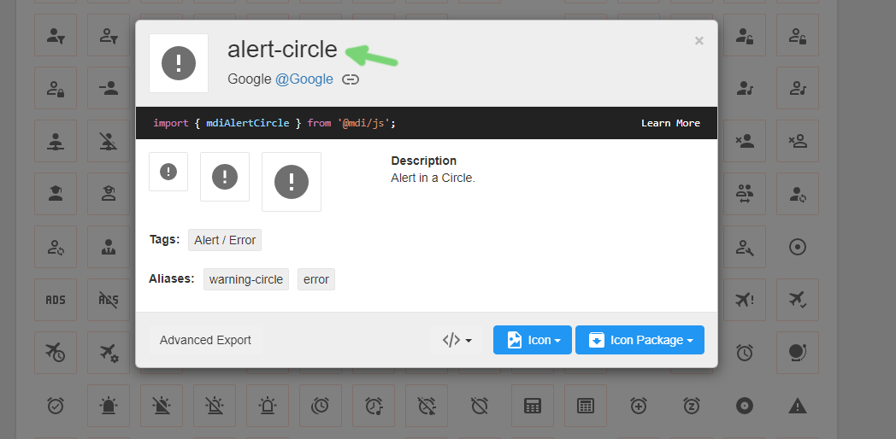

# :framed_picture: Icons

bridge. uses [material design icons](https://materialdesignicons.com/) in its UI components. Sometimes, extensions need to choose icons for various reasons, such as preset icons.

An icon in a bridge. extension should be represented by the icon's id, prefixed by `mdi-`. To use an icon from this site, find an icon that you like, either by looking through the list or searching, and click on it. 

In the window that appears, you should copy the id at the top and prefix it with `mdi-`. For example, an icon with an id of `alert-circle` would be `mdi-alert-circle`.