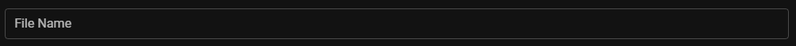
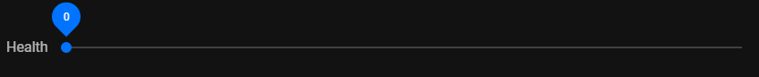
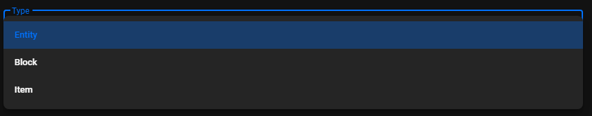

# :memo: Preset Manifest

The preset manifest is essential for bridge. to register your preset. Below are detailed descriptions all of the fields available in a preset manifest.

## name

-   Type: `string`
-   Required: :white_check_mark:

This states the name that you want to give to your preset. It will be the primary text used to display the preset in bridge.s UI, both in the sidebar and window content of the **New File** window.

```json
{
	"name": "Simple Entity"
}
```

## description

-   Type: `string`
-   Required: :no_entry_sign:

This should be a description of what this preset creates. In bridge.'s UI, this will display when the preset is selected in the **New File** window, under the preset [name](#name).

```json
{
	"description": "Creates a basic entity."
}
```

## icon

-   Type: `string`
-   Required: :white_check_mark:

This accepts the [standard icon format](/extensions/misc/icons/) that bridge. uses across its UI. This icon will be displayed next to the [`name`](#name) of the preset in the **New File** window.

```json
{
	"icon": "mdi-minecraft"
}
```

## category

-   Type: `string`
-   Required: :white_check_mark:

The category you set for your preset will decide which category the preset is found in, inside of the **New File** window's sidebar. You can add completely new categories or add your preset to existing ones. This string is translatable by bridge. meaning it accepts a translation key. Alternatively, if you surround the string in square brackets, e.g. `"[My Text]"`, bridge. will not attempt to translate the name.

If you want to add your preset to an existing category, you will need to reference the internal language file key of the category. Currently, bridge. uses the following keys in preset categories:

| Key                   | Translation  |
| --------------------- | ------------ |
| `fileType.block`      | Block        |
| `fileType.entity`     | Entity       |
| `fileType.item`       | Item         |
| `fileType.simpleFile` | Simple Files |
| `fileType.skins`      | Skins        |

```json
{
	"category": "fileType.entity"
}
```

```json
{
	"category": "[Custom Category]"
}
```

## requires

-   Type: `object`
-   Required: :white_check_mark:

This field allows you to disable and hide your preset if specific project conditions are not met. You are able to specify one or more of the following conditions:

### targetVersion

-   Type: `[ComparisonOperator, Version]`

Allows you to test whether the project's target version, inside of the project config, matches an inequality test. The allowed comparison operators are as follows: `>`, `>=`, `=`, `<`, `<=`

```json
{
	"requires": {
		"targetVersion": [
			">=", // The comparison operator to use in the test
			"1.17.0" // The version to compare with the project target version
		]
	}
}
```

### packTypes

-   Type: `PackTypeId[]`

Allows you to test whether the project contains the specified [pack types](/extensions/misc/pack-types).

```json
{
	"requires": {
		"packTypes": [
			"behaviorPack" // The id of a pack type in a project
		]
	}
}
```

### experimentalGameplay

-   Type: `ExperimentalGameplay[]`

Allows you to check whether certain experimental gameplay toggles are enabled or disabled in the project config. The available toggles can be found in our [experimental gameplay toggles definition](https://github.com/bridge-core/editor-packages/blob/main/packages/minecraftBedrock/experimentalGameplay.json), and should be any of the `icon` fields.

```json
{
	"requires": {
		"experimentalGameplay": [
			"holidayCreatorFeatures", // The id of an experimental toggle.
			"!upcomingCreatorFeatures" // Values can be negated when prefix with '!'
		]
	}
}
```

## additonalModels

-   Type: `Record<string, any>`
-   Required: :no_entry_sign:

This field allows you to declare any extra variables that you may want to use in your preset, that aren't already defined by an input in [`fields`](#fields).

Additonally, the `PRESET_PATH` variable has some custom behavior too. When this variable is defined in `additonalModels`, it will create a UI, as shown below. This UI allows the user to select a path which can then be passed to the [`createFiles`](#createfiles) and [`expandFiles`](#expandfiles) fields to decide where to create the files. Whatever you set its value to be in `additonalModels`, will be the default path in the UI.


```json
{
	"additonalModels": {
		"PRESET_PATH": "entities/",
		"CUSTOM_VARIABLE": "data"
	}
}
```

## fields

-   Type: `PresetField[]`
-   Required: :white_check_mark:

With the `fields` property, you are able to build a form for the user to input data into, in order to create the preset. There are a variety of different input types that you are able to use and each is documented below.

### Common

Each type of input is defined in a similar way; the general form of an input is an array of three values, described below in order.

-   A string representing the display name of the input. This will be used as a label on the input to briefly describe what it does.
-   A string matching the name of the variable to assign the input data to. The purpose of this is to allows you to access the user input by referencing this varible in either the [`createFiles`](#createfiles) and [`expandFiles`](#expandfiles) fields, or a preset script.
-   An object for configuring the type of input and any other parameters for that type of input. Each different configuration is described below.

#### type

-   Type: `string`
-   Default: `textInput`

This field simply defines what type of input this field should be. The allowed values are: [`fileInput`](#file-input), [`numberInput`](#number-input), [`textInput`](#text-input), [`switch`](#switch-input), [`selectInput`](#select-input)

#### optional

-   Type: `boolean`

Specifies whether the field is optional or not. If it is optional, the preset can be created without this field being filled in.

#### default

-   Type: `string`

Defines what the default value of this input should be. If it isn't specified, the field will just be blank by default.

:::warning
The data from most advanced input fields should be handled by a [preset script](/extensions/presets/preset-scripts).
:::

### Text Input

This is the most basic, default input that an input can use, and creates a basic text input.

#### validate

-   Type: `string[]`

Defines which validation rules must be true on the input for it to be considered valid. If one or more of the rules are not met, the user will be unable to create the preset. The validation rules available are: `alphanumeric`, `lowercase`, `required`, `numeric`



```json
{
	"fields": [
		["File Name", "FILE_NAME", { "validate": ["required", "alphanumeric"] }]
	]
}
```

### File Input

This input type allows the user to import any file from on their computer. This can be useful for allowing the user to add a custom texture to an entity preset, for example.

#### accept

-   Type: `string`

This defines the [file type acceptors](https://developer.mozilla.org/en-US/docs/Web/HTML/Element/input/file#accept) that are allowed in this file input. Commonly used values are `application/json` and `image/png`.

#### icon

-   Type: `string`

This accepts the [standard icon format](/extensions/misc/icons/) that bridge. uses across its UI. This icon will be displayed on the left side of the input field.

#### multiple

-   Type: `boolean`

This tells the file picker that is opened, whether to accept a list of multiple files in this single input.


```json
{
	"fields": [
		[
			"Entity Model (Optional)",
			"MODEL",
			{
				"type": "fileInput",
				"accept": "application/json",
				"optional": "true",
				"icon": "mdi-file-chart"
			}
		]
	]
}
```

### Number Input

This input type creates a slider, which the user can use to select a numerical value.

#### min

-   Type: `number`

This option allows you to customize the lowest possible value (inclusive) that your number input slider can reach. This will also act as the default value if the [`default`](#default) option is not specified.

#### max

-   Type: `number`

This option allows you to customize the highest possible value (inclusive) that your number input slider can reach.

#### step

-   Type: `number`

The step of the number input slider sets by how much the value will change per section of the slider, allowing you to increase or decrease its accuracy. For example, a step of 5 would result in only multiples of 5 being selectable by the input.



```json
{
	"fields": [
		[
			"Health",
			"HEALTH",
			{ "type": "numberInput", "min": 0, "max": 10, "step": 1 }
		]
	]
}
```

### Switch Input

This input type creates a toggleable switch and is assigned a boolean value which represents whether the switch is on or off. This field does not contain any extra parameters, as it is a simple switch.


```json
{
	"fields": [["Client Entity", "CLIENT_ENTITY", { "type": "switch" }]]
}
```

### Select Input

This input type creates a dropdown menu of which the user can select from a list of pre-set options.

#### options

-   Type: `string[] | { text: string, value: string }[] | { fileType: string; cacheKey: string }`

This allows you to establish which options should be available in the dropdown menu.

The options can be defined three different ways:

-   It can be defined as a simple array of strings that will show up in the dropdown. The values assigned to the input variable will be the same as the option text displayed to the user.

```json
{
	"fields": [
		[
			"Type",
			"TYPE",
			{
				"type": "selectInput",
				"options": ["Entity", "Block", "Item"]
			}
		]
	]
}
```

-   It can be defined as a list of objects with `text` and `value` properties. This is the preferred method for most use cases, as it allows you to set the text that the user will see (`text`) and the value that will be assigned to the input variable (`value`), independently.




```json
{
	"fields": [
		[
			"Type",
			"TYPE",
			{
				"type": "selectInput",
				"options": [
					{ "text": "Entity", "value": "entity" },
					{ "text": "Block", "value": "block" },
					{ "text": "Item", "value": "item" }
				]
			}
		]
	]
}
```

-   The final method is the most complex; it allows you to fetch a list of data from bridge.'s [lightning cache](TODO), which means that the input can support dynamically changing options as the user works on their project and more data is added to cache. It is defined as an object with `fileType` and `cacheKey` properties, where `fileType` is the [file type id](TODO) of the files that you want to get cache data from. `cacheKey` is the [cache id](TODO) from the file type's cache definition that you want to fetch the options from.

```json
{
	"fields": [
		[
			"Type",
			"TYPE",
			{
				"type": "selectInput",
				"options": {
					"fileType": "entity",
					"cacheKey": "family"
				}
			}
		]
	]
}
```

## createFiles

-   Type: `(string | [string, string, CreateFileOptions])[]`
-   Required: :no_entry_sign:

This property is essential for your preset to create files when it is used. The primary usage of this field is define, where to copy files from your preset, to the user's project and what to do to the files while copying or once copied. Each item should be an array of three values:

-   A string that references the file name to copy from your preset into the user's project.
-   A string that reference the target path inside of the user's project, to copy the file to.
-   An object that contains additional options to use when creating the file. Documentation of the available properties can be found below.

### inject

-   Type: `string[]`

The inject field is important, as it allows you to inject variables that have been assigned from various inputs, into the file you are copying over and its path. It accepts a list of variable names that have either been defined in [`additonalModels`](#additonalmodels), or in an [input field](#fields). By default, the variable `PROJECT_PREFIX` is exposed to presets automatically; its value will be the current project's project prefix, which is defined in the [project config](/guide/misc/project-config). Variables will be injected into both the file path and content at locations that you can define. In order to define where the data from these variables is injected, you must write **the variable name surrounded by double curly brackets**.

### openFile

-   Type: `boolean`

This option simply causes the file to be opened when the preset is created. This is useful for opening the files of your preset that the user may want to modify after creating them and it will remove tab clutter by not opening too many files unnecessarily.

### packPath

-   Type: [`PackTypeId`](/extensions/misc/pack-types)

This specifies which pack type this file should go in. In the background, bridge. will use this to prepend the path of the pack type to the path that you have set to ensure the file is created in the correct location.

```json
{
	"createFiles": [
		[
			"entity.json",
			"entities/{{PRESET_PATH}}{{IDENTIFIER}}.json",
			{
				"inject": ["IDENTIFIER", "PROJECT_PREFIX", "PRESET_PATH"],
				"openFile": true,
				"packPath": "behaviorPack"
			}
		]
	]
}
```

It is also used to define which [preset scripts](/extensions/presets/preset-scripts) to execute when this preset is used. This is done by simply done by referencing the path to a preset script; you can reference [built-in preset scripts](https://github.com/bridge-core/editor-packages/tree/main/packages/minecraftBedrock/presetScript) by using the form `presetScript/<FILE_NAME>`. Alternatively, you can reference your own preset scripts in your extension with a relative import, as shown in the example below.

```json
{
	"createFiles": ["presetScript/entityImages.js", "./customScript.js"]
}
```

## expandFiles

-   Type: `[string, string, CreateFileOptions][]`
-   Required: :no_entry_sign:

This option allows you to append content to plain text files or merge JSON with other JSON files when your preset is used. If the file doesn't exist already, it will be created. Similarly to [`createFiles`](#createfiles), this contains a list of arrays containing three values:

-   The name of the file in your preset that contains the data that you want to merge into an existing file.
-   The path of the file in the user's project to target and add the data to.
-   An object that contains additional options to use when expanding the file. These properties are identical in name and function to those in the [`createFiles`](#createfiles) property ([`inject`](#inject), [`openFile`](#openfile), [`packPath`](#packpath)).

```json
{
	"expandFiles": [
		[
			"en_US.lang",
			"texts/en_US.lang",
			{
				"inject": ["IDENTIFIER", "DISPLAY_NAME", "PROJECT_PREFIX"],
				"packPath": "resourcePack"
			}
		]
	]
}
```
