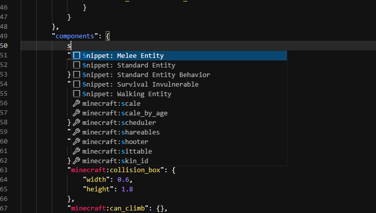

# 🔗 Snippets

This article will go over bridge.'s snippet system.

In this article you will learn the following:

:ballot_box_with_check: What is a snippet?<br />
:ballot_box_with_check: How to use a snippet within bridge.<br />
:ballot_box_with_check: How to create your own snippet.<br />

## Basics

Essentially a snippet is a piece of text that a user can quickly insert into any file; they can be used in any both JSON file types and text based file types, such as functions and scripts. Snippets can be created through bridge.'s extension API and you'll find out how below!

## Using Snippets

By default, bridge. doesn't ship with any snippets built in. Instead, you need to [download an extension](/extensions/index.html#installing-extensions) from bridge.'s extension store that includes snippets, or [make your own](#creating-a-snippet). Once installed it is easy to use these snippets, and usage in both bridge.'s text editor and tree editor are described below.

### Text Editor

In bridge.'s text editor you need to select a valid location where the snippet can be inserted. Then in the auto-completions list (which you can force with `ctrl + space`), you will find your snippets, as shown in the image below.



### Tree Editor

In bridge.'s tree editor, similarly to the text editor, you need to select the node in the tree which accepts the snippet and it will show up in auto-completions automatically, as shown in the image below.


## Creating A Snippet

### Setup

In order to get started with creating a snippet, you need to set up a valid [extension](/extensions/index.html#creating-extensions) to contain your snippets. Once this is done, you can begin by creating a `snippets` folder inside of your extension's folder.

Inside of this `snippets` folder we will create a new file for each snippet. Our example snippet here will be called `exampleSnippet.json` for simplicity.

```{3}
.
├─ 📁 snippets
│  └─ 📝 exampleSnippet.json
```

### Writing The Snippet

In our new snippet file, we will write the following:

```json
{
	"name": "Example Snippet",
	"description": "This adds a damage sensor that makes the entity invulnerable.",
	"fileTypes": ["entity"],
	"locations": [
		"minecraft:entity/components",
		"minecraft:entity/component_groups/*"
	],
	"data": {
		"minecraft:damage_sensor": {
			"triggers": [
				{ "deals_damage": false }
			]
		}
	}
}
```

Now let's go through the different fields that we have utilized here:

- The [`name`](/extensions/snippets/documentation.html#name) and [`description`](/extensions/snippets/documentation.html#description) fields are used to tell bridge. how both the text and tree editor should display your snippet within auto-completions.
- [`fileTypes`](/extensions/snippets/documentation.html#filetypes) and [`locations`](/extensions/snippets/documentation.html#locations) tell bridge. where your snippet is allowed to be inserted into a file.
- [`data`](/extensions/snippets/documentation.html#data) defines what data to insert into the file when the snippet is used.

:::tip
Make sure to read through our detailed [snippet documentation](/extensions/snippets/documentation)!
:::
