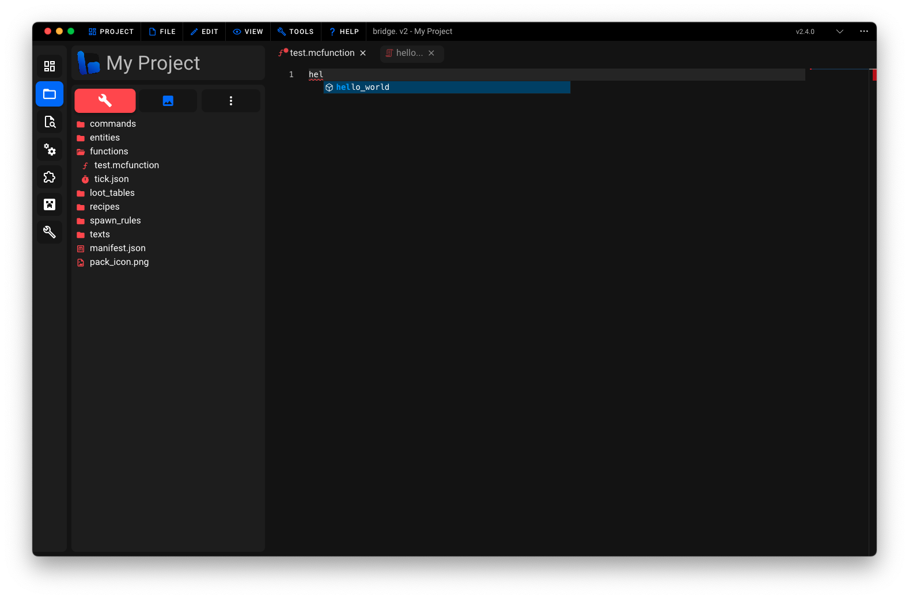

# 🖨 Dash Commands

This page serves as an introduction to bridge.'s Dash commands which you can use wherever Minecraft accepts regular commands.

:::danger
Dash commands cannot be used directly within Minecraft. They are only usable within your project files.
:::

Inside of this article, you will learn about the following topics:

:ballot_box_with_check: What is a Dash command?<br/>
:ballot_box_with_check: How to install a Dash command.<br/>
:ballot_box_with_check: How to use a Dash command.<br/>
:ballot_box_with_check: How to write Dash commands.<br/>

## Basics

Dash commands allow users to generate commands programmatically with JavaScript or TypeScript. They integrate seamlessly into bridge. by appearing alongside Minecraft's built-in commands within auto-completions.

bridge. loads Dash commands from the `commands/` folder within your behavior pack.

## Installation

You can install Dash commands from bridge.'s [extension store](/extensions/#installing-extensions) if you do not feel confident in writing your own Dash commands.

## Usage

After installing or writing your first Dash command, it will naturally appear within bridge.'s command auto-completions within mcfunction or JSON files. You can then use the command as you would use a regular Minecraft command.



## Writing Dash Commands

Start by creating a JavaScript or TypeScript file within the `commands/` folder of your behavior pack. You can only write a single command per file which should be exported as the default export.

```ts
export default defineCommand(() => {...})
```

:::tip
The call to `defineCommand(...)` is optional. It enables TypeScript to validate the passed component instantiation function.
:::

### `name(commandName: string): void`

Calling this function is required. It sets the name of the command which will be used within auto-completions.

```ts
export default defineCommand(({ name }) => {
	name('my_command')
})
```

### `schema(schemaDefinition: any): void`

Use this function to declare a command schema to be used within bridge.'s auto-completions. Command schemas use a proprietary format which is described in detail [here](/extensions/json/command-schema).

```ts
export default defineCommand(({ schema }) => {
	schema([
		{
			description: 'Say hello to a player!',
			arguments: [
				{
					type: 'selector',
				},
			],
		},
	])
})
```

### `template((commandArgs: any[]) => void): void`

Use this function to return a list of commands to be executed whenever your Dash command is used. The `commandArgs` parameter is an array of arguments passed to the command.

```ts
export default defineCommand(({ template }) => {
	template(([selector]) => {
		return [
			`say Hello ${selector}!`,
			`say I hope you are having a great day!`,
		]
	})
})
```

:::tip
The `template` callback function can either return a string or an array of strings. If you return an array of strings, bridge. will automatically join the strings with a newline character upon transforming your Dash command.
:::

And that's it, you have just written your first basic Dash command! :tada:
