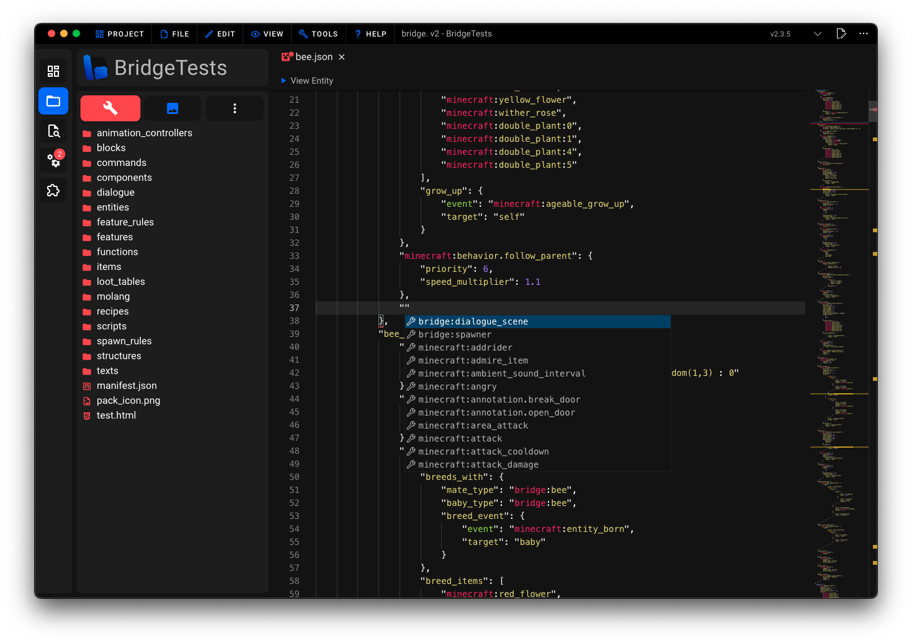

# 📦 Dash Components

This page serves as an introduction to bridge.'s Dash components which are available for use within your entity, block and item files.
This article will cover the following topics:

:ballot_box_with_check: What is a Dash component?<br/>
:ballot_box_with_check: How to install a Dash component.<br/>
:ballot_box_with_check: How to use a Dash component.<br/>
:ballot_box_with_check: How to write Dash components.<br/>

## Basics

Dash components allow you to extract common logic from entity, block and item files and to generate JSON using JavaScript or TypeScript. They integrate seamlessly into bridge. by appearing alongside Minecraft's built-in components within auto-completions.

### Component Locations

Dash components are loaded from the `components/` folder within your behavior pack.

-   Item components are expected to be within the `components/item/` folder
-   Block components are expected to be within the `components/block/` folder
-   Entity components are expected to be within the `components/entity/` folder

## Installation

If you do not feel confident in writing your own Dash components, you can install pre-written components from bridge.'s [extension store](/extensions/#installing-extensions). Simply select the "components" tab within the sidebar and choose the component you need.

## Usage

After installing or writing your first Dash component, it will naturally appear within auto-completions within your entity, block and item files. You can then use the component as you would any other component.



## Writing Dash Components

Start by creating a JavaScript or TypeScript file within the location described [here](#component-locations). You can only write a single component per file which should be exported as the default export.

```ts
export default defineComponent(() => {...})
```

:::tip
The call to `defineComponent(...)` is optional. It enables TypeScript to validate the passed component instantiation function.
:::

### `name(componentName: string): void`

Calling this function is required. It sets the name of the component which will be used within auto-completions.

```ts
export default defineComponent(({ name }) => {
	name('bridge:my_component')
})
```

### `schema(schemaDefinition: any): void`

Use this function to set a JSON schema to validate the component's properties and provide auto-completions to your users.

```ts
export default defineComponent(({ schema }) => {
	schema({
		type: 'object',
		properties: {
			my_property: {
				type: 'number',
				description: 'This is a Dash component property',
			},
		},
	})
})
```

### `template((componentProps: any, context: ITemplateContext) => void): void`

Use this function to return a JSON template for the component. The created templates will be merged with the JSON file the component is used in. The `componentProps` parameter contains all properties defined within the current component's JSON file.

In the example below, the `componentProps` parameter has the value `{ "my_property": 42 }`.

```json
{
	"minecraft:entity": {
		"description": {
			"identifier": "bridge:my_entity"
		},
		"components": {
			"bridge:my_component": {
				"my_property": 42
			}
		}
	}
}
```

```ts
export default defineComponent(({ template }) => {
	template(({ my_property }, { create }) => {
		create(
			{
				'minecraft:health': {
					max: my_property,
					value: my_property,
				},
			},
			'minecraft:entity/components'
		)
	})
})
```

You can call `create(...)` to create a JSON template. The first argument is the JSON to create and the second argument is the path within the JSON file where the template should be created. Omitting the second argument will create the template at the root of the JSON file.

And that's it, you have just written your first basic Dash component! :tada:

<!-- TODO: Document ITemplateContext -->
<!-- ## Advanced

-   `create(...)` can also accept a third optional argument to implement a Dash merge strategy:

```ts
const myMergeStrategy = (
	// You can use the default merge strategy if necessary
	deepMerge: (existing: any, incoming: any) => any,
	existing: any,
	incoming: any
) => {
	return incoming // Always overwrite existing values
}
``` -->
