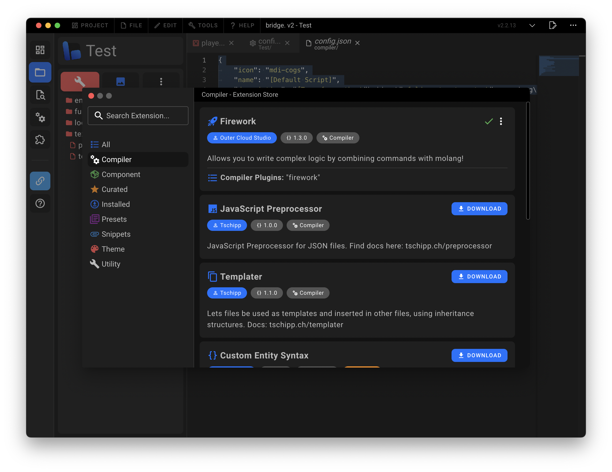

# ⚡️ Dash

This page serves as an introduction to bridge.'s compiler Dash and its functionality.
You will learn about the following topics inside of this article:

:ballot_box_with_check: What is Dash?<br/>
:ballot_box_with_check: How to run Dash.<br/>
:ballot_box_with_check: How to configure different build profiles.<br/>
:ballot_box_with_check: How to write plugins for Dash.<br/>

## Basics

[Dash](https://github.com/bridge-core/dash-compiler/) is the default compiler all bridge. projects use. It powers custom syntax such as [custom components](/guide/advanced/custom-components), [custom commands](/guide/advanced/custom-commands) and [molang files](/guide/advanced/molang-files). Additionally, Dash is also responsible for moving your compiled projects to the com.mojang folder.

:::tip
A compiler is a program that takes a source file, applies a set of transformations to it and writes the result to a destination file.
:::

### Built-in Dash

As bridge. comes with Dash built-in, you do not need to install or setup it yourself. We are going to refer to this variant of Dash as "built-in Dash".

:::info
[Skip to the "Running Dash" section](#running-dash) if you are not interested in running Dash independently from bridge.
:::

### Standalone Build

You can also run a standalone build of Dash. This build is orders of magnitudes faster than the built-in version of Dash and it can be used independently of bridge.
We are going to refer to this variant of Dash as "standalone Dash".

:::warning
You should only use the standalone version of Dash if you are familiar with terminal commands.
:::

The standalone build of Dash is also open-source and can be found on GitHub: [bridge-core/deno-dash-compiler](https://github.com/bridge-core/deno-dash-compiler).

#### Installation

There are multiple ways to install the standalone version of Dash. For the most convenient experience, make sure that you have [Deno](https://deno.land/) installed.

1. Open a terminal and navigate to your project's root directory
2. Run `deno task setup`. This command installs Dash as a terminal command
3. You can now use the standard `dash_compiler` commands or run the shorthand `deno task watch` and `deno task build`

#### Watch Command

Watch for changes to your project and recompile. Outputs to com.mojang if Minecraft is installed on your computer.

```bash
    dash_compiler watch
    # Or configure options
    dash_compiler watch --out preview --reload 4350
```

| Option            | Default           | Description                                                                                             |
| ----------------- | ----------------- | ------------------------------------------------------------------------------------------------------- |
| `--out [path]`    | com.mojang folder | Configure the output directory. Use `--out preview` to output to Minecraft Preview                      |
| `--reload [port]` | 8080              | Open a web socket server that will reload scripts and functions when you connect to it within Minecraft |

#### Build Command

Build your project. Outputs to "builds/dist" folder within your project's root directory.

```bash
    dash_compiler build
    # Or configure options
    dash_compiler build -m development -c path/to/config.json
```

| Option                               | Alias | Description                | Description                                                      |
| ------------------------------------ | ----- | -------------------------- | ---------------------------------------------------------------- |
| `--mode [development \| production]` | `-m`  | "production"               | Tell bridge. whether to create a production or development build |
| `--compilerConfig`                   | `-c`  | Loaded from project config | Use a different compiler config to load your plugins             |

## Running Dash

### Compiler Window

If you run the built-in version of Dash, you can make use of bridge.'s compiler window to configure Dash.
Simply open the compiler window by clicking on the corresponding sidebar icon:


### Watch Mode

By default, Dash will watch any changes you make within bridge. and recompile affected files. You can disable this behavior within the compiler window.


### Production Builds

Whenever you [export your project](/guide/misc/export-project), bridge. uses Dash to create a production build of your project. You can also manually request a production build that outputs to the "builds/dist" folder by using the compiler window. Simply select the "Default Config" within the "Build Profiles" tab.


Production builds can be configured with plugins to produce an optimized output.

**Examples:**

-   Remove comments
-   Minify files
-   Remove debug messages

## Build Profiles

### Default Profile

The default build profile of Dash is located within your [project config](/guide/misc/project-config). You want to look for the `compiler` field within this file. You can configure the plugins dash runs using it.

:::tip
Set the "compiler" field to `false` to disable Dash.
:::

```json
{
	"compiler": {
		"plugins": [
			"typeScript",
			"entityIdentifierAlias",
			"customEntityComponents",
			"customItemComponents",
			"customBlockComponents",
			"customCommands",
			"moLang",
			"formatVersionCorrection",
			[
				"simpleRewrite",
				{
					"packName": "MyProject"
				}
			]
		]
	}
}
```

The `plugins` array either expects items of type `string` which is supposed to be the unique identifier of a compiler plugin or a tuple where the first item is the unique identifier of the plugin and the second item is an object containing the plugin's configuration.
The position of a plugin in the `plugins` array is important as it determines the order in which the plugins are run. The first plugin in the array is run first, the second plugin in the array is run second and so on.

### Adding New Profiles

You can add arbitrary new build profiles by adding a new JSON file to the `.bridge/compiler/` folder within your project. The name of the JSON file does not matter and you can add as many profiles as you want.

```json
{
	"icon": "mdi-rocket",
	"name": "My Own Build Profile",
	"description": "This is my very own build profile",
	"plugins": [
		"typeScript",
		"entityIdentifierAlias",
		"customEntityComponents",
		"customItemComponents",
		"customBlockComponents",
		"customCommands",
		"moLang",
		"formatVersionCorrection",
		[
			"simpleRewrite",
			{
				"packName": "Test"
			}
		]
	]
}
```

### name

-   Type: `string`
-   Required: :white_check_mark:

The `name` property states the name of the build profile. It is used to display a name for the build profile within the compiler window.

### icon

-   Type: `string`
-   Required: :white_check_mark:

The `icon` property gives you the option to assign an unique icon to the build profile.
:::tip
You can read more about how icons work [here](/extensions/misc/icons/).
:::

### description

-   Type: `string`
-   Required: :white_check_mark:

Describe the purpose of the build profile.

## Built-in Plugins

Dash comes with the following plugins built-in. You don't need to install them in order to use them.

### typeScript

The TypeScript plugin is used to automatically transpile your project's TypeScript files into JavaScript.
You can configure the TypeScript plugin with the following options:

```json
[
	"typeScript",
	{
		// Generate a source map for the transpiled code
		// Default: false
		"inlineSourceMap": true
	}
]
```

### entityIdentifierAlias

This plugin register aliases for entity files which other plugins can use.

### customEntityComponents

This plugin powers [custom entity components](/guide/advanced/custom-components). You can configure the plugin to run legacy custom entity components from bridge. v1.

```json
[
	"customEntityComponents",
	{
		// Allows you to run legacy custom components from bridge. v1
		// Default: false
		"v1CompatMode": true
	}
]
```

### customItemComponents

This plugin powers [custom item components](/guide/advanced/custom-components). You can configure the plugin to run legacy custom item components from bridge. v1.

```json
[
	"customItemComponents",
	{
		// Allows you to run legacy custom components from bridge. v1
		// Default: false
		"v1CompatMode": true
	}
]
```

### customBlockComponents

This plugin powers [custom block components](/guide/advanced/custom-components). You can configure the plugin to run legacy custom block components from bridge. v1.

```json
[
	"customBlockComponents",
	{
		// Allows you to run legacy custom components from bridge. v1
		// Default: false
		"v1CompatMode": true
	}
]
```

### customCommands

This plugin powers [custom commands](/guide/advanced/custom-commands). Its options allow you to run old v1 custom commands and to add new command locations.

```json
[
	"customCommands",
	{
		// Allows you to run old v1 custom commands
		// Default: false
		"v1CompatMode": true,
		// Allows you to add new command locations
		// Default: false
		"include": {
			// Define command locations per file type
			"entity": [
				// Glob pattern to describe where to look for commands
				"minecraft:entity/components/my:component/run_commands",
				"minecraft:entity/component_groups/*/my:component/run_commands"
			]
		}
	}
]
```

:::tip
You can find all of bridge.'s file types [here](/extensions/other/default-file-types).
:::

:::info
Glob patterns allow you to specify exactly where to look for commands within a JSON file.

-   \* is a wildcard that matches any property
-   \*\* is a wildcard that matches any property and its children
-   Property names are separated by a slash (/)

:::

### moLang

This plugin powers [custom Molang files](/guide/advanced/molang-files). You can configure the plugin to add new Molang locations.

```json
[
	"moLang",
	{
		// Allows you to add new Molang locations
		// Default: false
		"include": {
			// Define Molang locations per file type
			"entity": [
				// Glob pattern to describe where to look for Molang files
				"minecraft:entity/components/my:component/condition"
			]
		}
	}
]
```

### generatorScripts

This plugin needs to be active in order to use [generator scripts](/guide/advanced/generator-scripts/).

### formatVersionCorrection

This plugin is used by bridge. to make format versions work within JSON files that Minecraft normally does not accept.

### simpleRewrite

This plugin is rewriting the files of your add-ons to the com.mojang folder for development builds and to the `builds/dist` folder for production builds. It can be configured with the following options:

```json
[
	"simpleRewrite",
	{
		// The output name of your add-on
		// Default: "Bridge"
		"packName": "MyProject",
		// Set the suffix of the output pack name per pack type
		"packNameSuffix": {
			"behaviorPack": "BP",
			"resourcePack": "RP"
		}
	}
]
```

:::tip
Read more about bridge.'s built-in pack types [here](/extensions/misc/pack-types).
:::

### rewriteForPackaging

This plugin is used to rewrite files within an add-on so that the project can later be packaged into a .mcaddon, .mctemplate or .mcworld file. You can configure the plugin with the following options:

```json
[
	"rewriteForPackaging",
	{
		// The output name of your add-on
		// Default: "Bridge"
		"packName": "MyProject",
		// Which package to create; this option is required
		// Can be "mcaddon", "mctemplate" or "mcworld"
		"format": "mcaddon"
	}
]
```

## Installing Plugins

You can install additional compiler plugins from the extension store. Select the "Compiler" category to view all available plugins.
:::tip
You can read more about installing extensions [here](/extensions/#installing-extensions).
:::

Once you have installed a plugin, you can enable it by adding it to the `compiler` section of your [project config](/guide/misc/project-config). The identifiers of installed plugins get displayed below the extension description within the extension store. This is the name you need to add to your build profile to enable the plugin.



## Writing Plugins

Do you need a bit more from Dash than what is currently available?
You can write your own compiler plugins to create anything you want. If you are interested in learning more about writing compiler plugins, you can [read about it here](/extensions/compiler-plugins).
