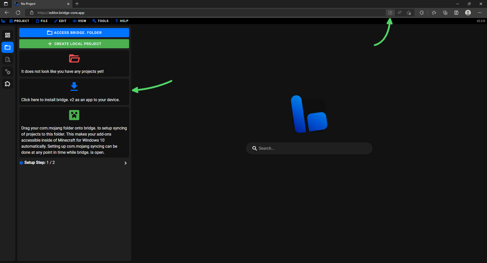
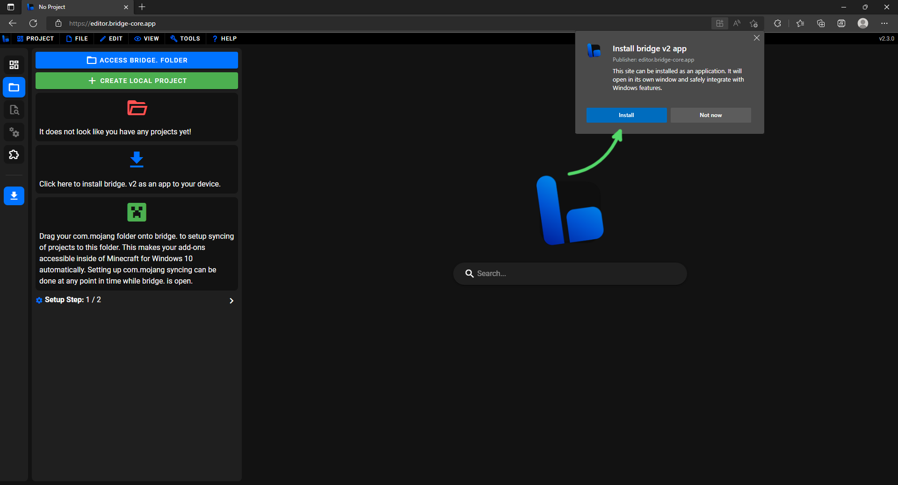
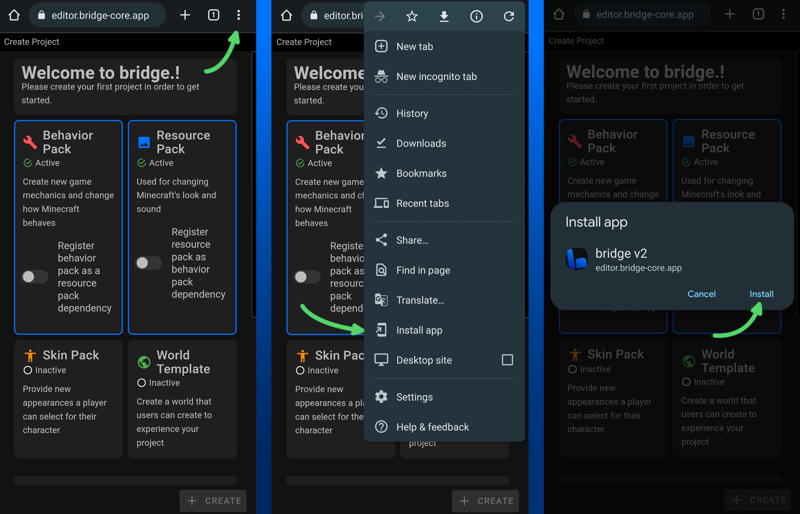

# ⬇️ Download

This article aims to explain to you how you can download and install bridge. v2 to your computer.
After reading it, you should know...

:ballot_box_with_check: Which devices support bridge. v2. 
:ballot_box_with_check: How to install bridge. v2 as an app. 

## Device Support

bridge. v2 can run on any sufficiently modern browser, including but not limited to:

-   Google Chrome (Android, Windows, MacOS and Linux)
-   Microsoft Edge (Windows, MacOS and Linux)
-   Mozilla Firefox (Android, Windows, MacOS and Linux)
-   Safari (MacOS and iOS)

**You do not need to install bridge. v2 to give it a try**: Simply visit https://editor.bridge-core.app/ within your browser to get a first impression of the app.

:::tip
If you like living dangerously, you can help us test the latest bridge. v2 features:

Our nightly builds are beta versions that release every night including all changes of the previous day from our [dev branch](https://github.com/bridge-core/editor/tree/dev).

Give it a try here: https://nightly.bridge-core.app/
:::

## Installation

No matter how you're installing bridge., you must first navigate to https://editor.bridge-core.app/.

### Chromium-based desktop browsers

This is the best way to experience bridge.! To install bridge. on a Chromium-based desktop browser, such as Google Chrome and Microsoft Edge, go to [bridge.'s site](https://editor.bridge-core.app/) and go through the following steps, which are also displayed in images below.

1. Click one of the following:
    - The install icon in the right side of the URL address bar.
    - If you haven't set up bridge. already, the install prompt in the sidebar.
    - The install notification.

2. Press **Install** on the prompt that shows.

### Chrome (Android)

In order to install bridge. on Google Chrome (Android), you will need to open the browser, go to [bridge.'s site](https://editor.bridge-core.app/) and go through the following steps, which are also displayed in an image below.

1. Press the three dots in the top right of the browser.
2. Select the **Install App** option in the menu that appears.
3. Press **Install** on the prompt that shows.

### Safari (iOS)

TODO: Describe installation
