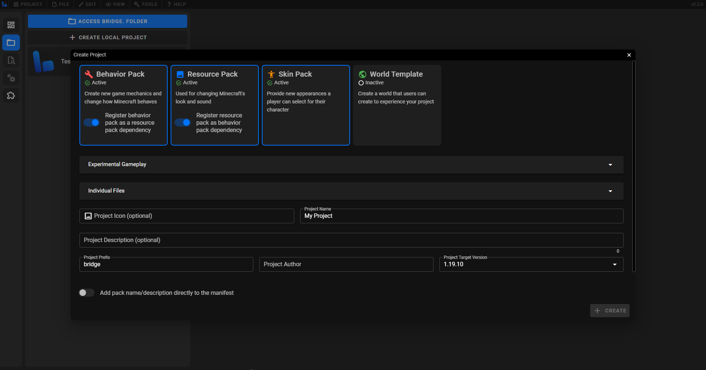
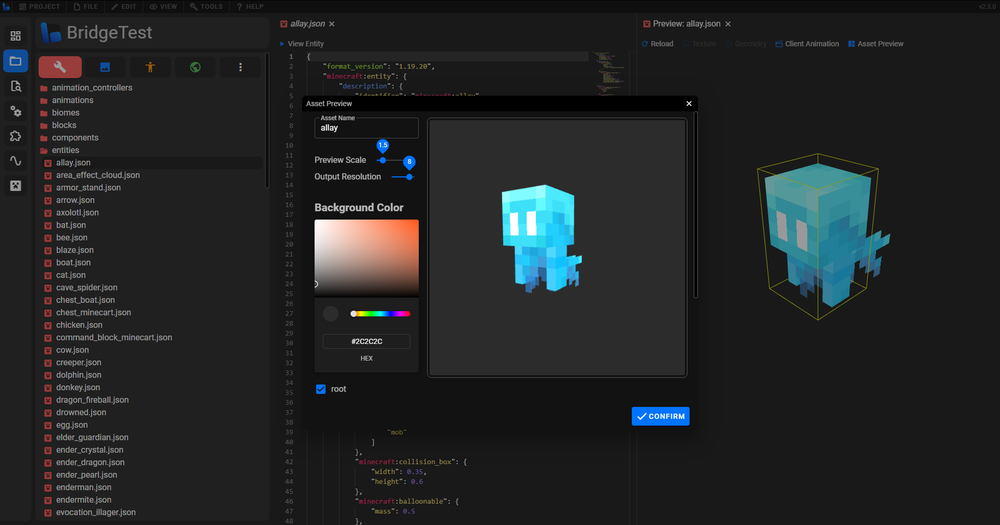
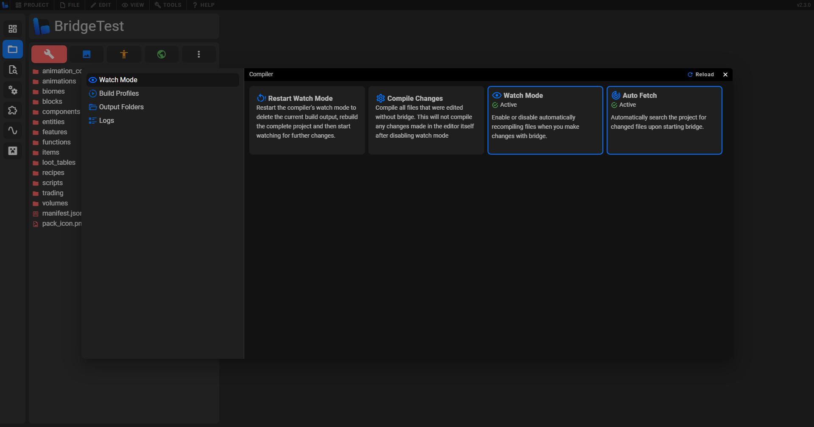
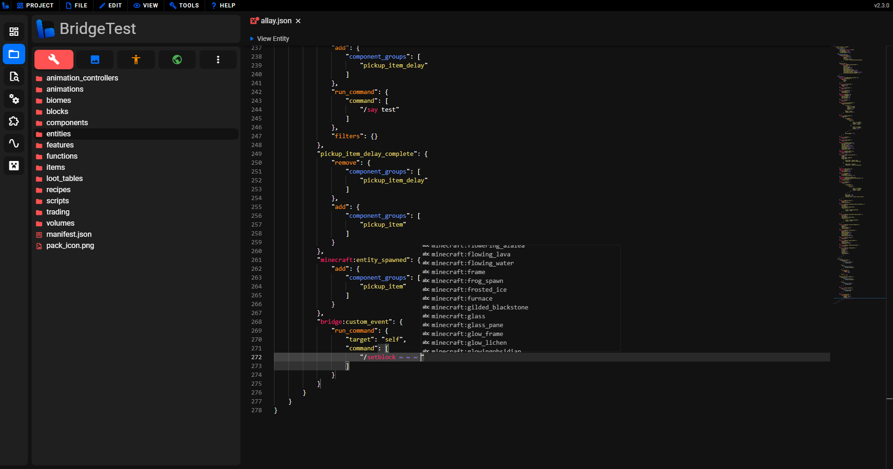
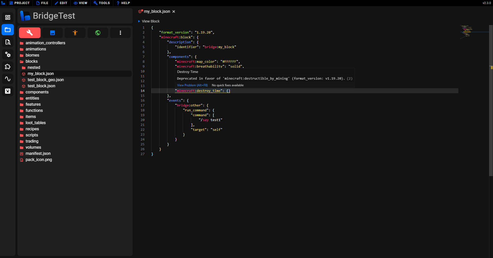
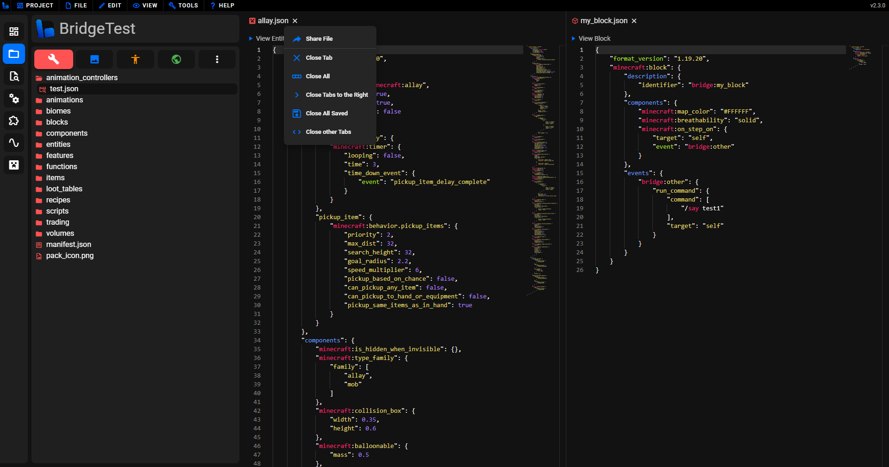

# 🚀 Features

On this page we will go through some of the main features that bridge. has to offer.

## Quick Project Setup

:factory: With bridge., setting up a Minecraft Bedrock project is as easy as filling a few inputs!

-   Create **behavior packs, resource packs, skin packs and world templates** quickly.
-   bridge. will create all files necessary for your packs to show in Minecraft, and additional files including a [project config](/guide/misc/project-config), to allow for compatibility with other tools.
-   If you [link bridge. to your com.mojang folder](/guide/misc/com-mojang-syncing/), your projects will automatically sync to Minecraft.

:lock: bridge.'s project structure stores your projects outside of the com.mojang folder by default, where they are safer, easier to access and easier to collaborate with others on.

-   If you need to uninstall Minecraft, your projects will be safe and **will not** be deleted.
-   Our project structure can **easily be used with GitHub** to collaborate with other creators and version control your projects.
-   This project strucutre is also used by other tools, so your project will remain compatible with tools following this [standard](https://github.com/Bedrock-OSS/project-config-standard).

## File Previews

:play_or_pause_button: bridge. allows you to preview a variety of different files without having to load up Minecraft!

-   View any model in your project; textures and animations will automatically be found by bridge., for you to view.
-   Quickly see collision boxes of blocks and entities, and view entity seat positions to find the perfect positions.
-   Conveniently view particle effects.
-   File previews will rapidly update when you make changes in a related file.

:framed_picture: With entities, you are also able to generate **Asset Previews** which are useful to showcase an entity. Below you can see how this works.

## Advanced File Creation

:bricks: With [bridge. presets](/extensions/presets/), you can create complete features, such as entities, items and blocks, by filling a small form. Any feature of an Add-On can also be created as an individual file, with a scaffold of the file already there for you!

-   bridge. supports every file that Minecraft does so by using bridge. you will be able to utilize every Add-On feature.
-   The files that you can create are determined by the experimental toggles and target version that you have configured in your [project config](/guide/misc/project-config). This ensures you don't use features that you shouldn't be using.

## Powerful Compiler

:zap: bridge. ships with the [Dash compiler](https://github.com/bridge-core/dash-compiler) built-in!

-   Configure Dash to compile your project how you like, with [compiler plugins](/extensions/compiler-plugins).
-   Utilize Dash's [built-in compiler plugins](/guide/advanced/dash/index.html#built-in-plugins), as well as some of the amazing plugins available in the extension store.

## Customizable Experience

:gear: Inside of bridge.'s settings, you can truly customize your experience with the editor.

-   Change how bridge. looks with [themes](/extensions/json/themes), dark and light mode toggling and font customization.
-   Switch between bridge.'s tree and text editors with ease and customize some of their behaviors, such as automatically opening tree nodes.
-   Modify which language bridge. should use. **This only applies for languages that our amazing community have helped add. Want to add support for another language to bridge., let us know in our [Discord](https://discord.gg/uj8K2S9)!**
-   Adjust the sidebar to work for you.

And lots more settings...

## Extension Support

:jigsaw: bridge. ships with a flexible extension API where you can add your own tools and features to bridge., or use an extension from our [vast library of community made extensions](https://github.com/bridge-core/plugins/tree/master/plugins).

- bridge. has an extension store which makes it easy to find, download and update extensions that have been made and published by our community and developers.

[Learn more about extensions here.](/extensions/index)

## Auto-completions and validation

:bulb: Inside of both bridge.'s text editor and tree editor, you will recieve dynamic, up-to-date and accurate auto-completions to greatly assist your development experience and guide you through a file.

- In our text editor, you will notice that your file is validated against [our schemas](https://github.com/bridge-core/editor-packages) and syntax errors will be pointed out to you!
- In the background, bridge. scans your packs and caches important data, such as identifiers, tags, events and more, so they can conveniently be proposed to you in auto-completions.
- You will only see auto-completions for features that you should be using; they will be filtered based on the `format_version` that you set in the file and the experimental toggles that are toggled in your [project config](/guide/misc/project-config).
- When opening files from outside of bridge., it will intelligently guess what type of file you have opened and show you relevant auto-completions.

## Flexible Tab System

:bookmark_tabs: Our tab system is designed to be flexible and supports many features that you'll be used to from typical code editors.

- Tabs can be opened in split-screen mode to easily view two files at once. This is convienient for [file previews](#file-previews), where the code can be viewed alongside the preview.
- bridge. supports a variety of tab types with more to come. This includes, tabs that render 3d models, tabs that display code in a custom editor, such as the tree editor, and more.
- By default, tabs will be temporary when opened initially; editing them or double clicking the tab will make them persistent. This helps keep your screen less cluttered with tabs.

## Global Find and Replace System

:mag_right: Ever needed to change the identifier of an item across your entire project, or just see where you have referenced some block? Well bridge. comes with a global find and replace system, similar to VSCode, where you can find any text in your project almost instantly.

- Search by string or Regex, it is up to you!
- Replacing supports Regex capture groups, as you would expect.

