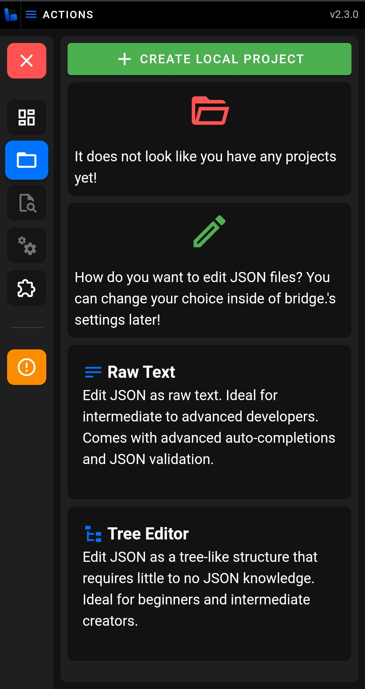

# 👣 Getting Started

Whether you are a newcomer to bridge., or to Add-Ons as a whole, this guide will serve as an introduction to get you comfortable with setting up and using bridge. This page is designed to be read in order, however if you already know something, feel free to skip to the next section.

In this guide, you will learn:

:ballot_box_with_check: How to set up a bridge. 
:ballot_box_with_check: How to set up a project. 
:ballot_box_with_check: How to get started with creating an Add-On with bridge. 

## Installation

bridge. can be used in a few ways across many platforms, due to its design as a **Progressive Web App**. The essentially means you can use bridge. on almost any device that has a modern browser, such as Chrome and Edge on desktop, or Chrome and Safari on Android and IOS.

We have a seperate [guide on how to install bridge. to your device](/guide/download/index), providing you are using a browser that supports doing so. You can alos use bridge. directly in your browser at https://editor.bridge-core.app/.

:::tip
Please note that the installation is not in the traditional sense of installing through an `exe` file, but bridge. will still behave like a native app and work offline.
:::

## Setting Up bridge.

When you open bridge. for the first time, you will be greeted by a setup process, that will vary slightly, depending on the browser that you are using.

On a fully supported Desktop browser, TODO

On a mobile browser, TODO

## Creating a Project

TODO

## Need Help?

If you have more questions about bridge., or creating Add-Ons, feel free to ask in the [official bridge. Discord server](https://discord.gg/jj2PmqU). Also, check out our [community page](/guide/community), for more useful links.

