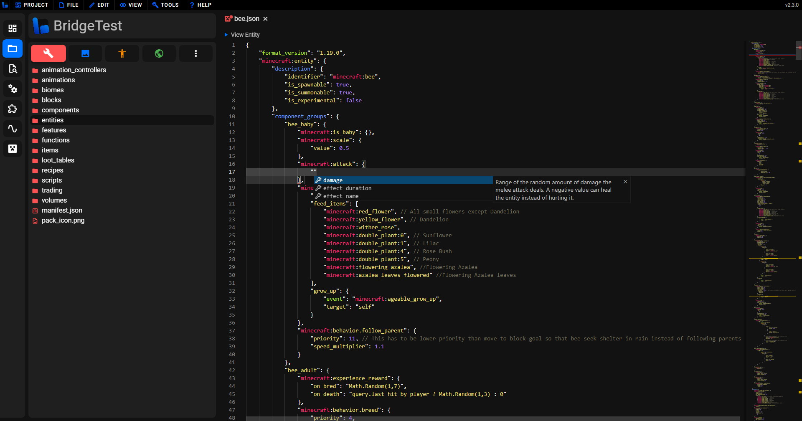
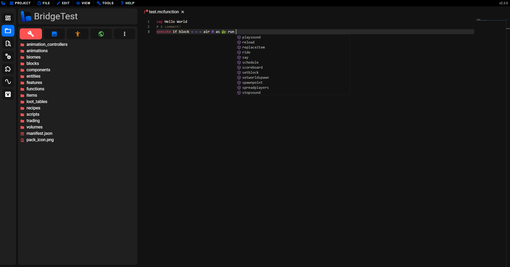
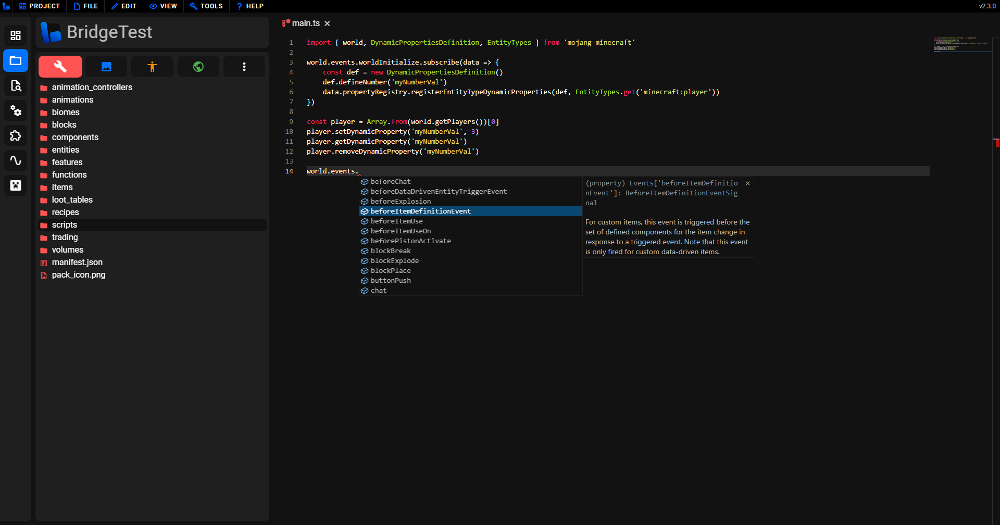
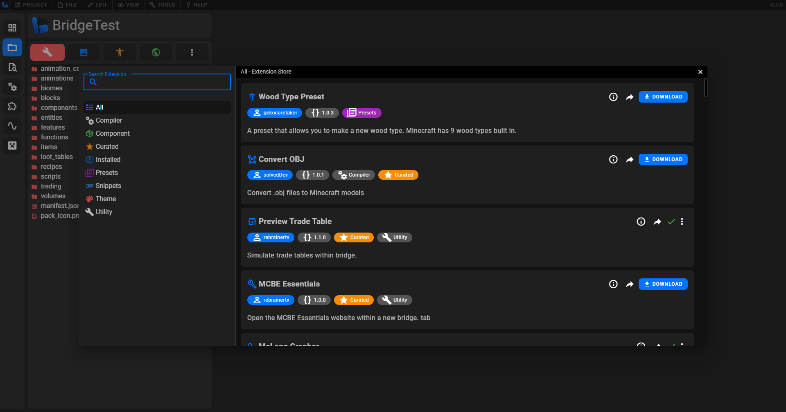

# 👣 Getting Started

Whether you are a newcomer to bridge., or to Add-Ons as a whole, this guide will serve as an introduction to get you comfortable with setting up and using bridge. This page is designed to be read in order, however if you already know something, feel free to skip to the next section.

In this guide, you will learn:

:ballot_box_with_check: How to set up bridge.<br/>
:ballot_box_with_check: How to set up a project.<br/>
:ballot_box_with_check: How to get started with creating an Add-On with bridge.<br/>

## Setting up bridge.

bridge. can be used in a few ways across many platforms, due to its design as a **Progressive Web App**. The essentially means you can use bridge. on almost any device that has a modern browser, such as Chrome and Edge on desktop, or Chrome and Safari on Android and IOS.

We have a seperate [guide on how to install bridge. to your device](/guide/download/index), providing you are using a browser that supports doing so. You can also use bridge. directly in your browser at https://editor.bridge-core.app/.

:::tip
Please note that the installation is not in the traditional sense of installing through an `.exe` file, but bridge. will still behave like a native app and work offline once installed.
:::

The rest of the setup process may differ depending on your browser you are using; read through the next steps and skip over them if they don't show for you.

1. [Link your `com.mojang` folder](/guide/misc/com-mojang-syncing/index) to bridge. by dragging it over the editor, from your devices file explorer.

2. Select the editor type that you want to use, from either the [**tree editor**](#tree-editor) or the [**text editor**](#text-editor). The text editor will feel familiar for users coming from VSCode, while the tree editor offers a simpler view into your files, ideal for beginners to JSON files.

3. Choose a bridge. folder. This is where bridge. will store your projects and other data, such as settings, that bridge. needs to work correctly. It should be an empty folder in somewhere accessible, such as `Documents`.

## Creating a project

To get started making addons with bridge. you need to create a project, but before creating a project, you should be aware of the different [project types](/guide/misc/project-types/index) that bridge. supports. Here, we will go through creating a [Local Project](/guide/misc/project-types/index.html#local-project), as they are available on every browser and platform that bridge. supports.

Start by pressing the "Create Local Project" button.


Then you will see the following project creation window:


In this menu, you should input the details of the project that you are creating. The various fields are explained below.

### 🔧 Pack Types

The packs that you add to your project will define the capabilities of your project. An Add-On generally consists of a behavior and resource packs, while full maps, or marketplace products may require behavior packs, resource packs, skin packs and world templates all together. Generally, behavior packs are server sided and resource packs are client side.

### 🧪 Experimental Gameplay

Experimental gameplay features are specific subsets of features that are locked behind a world toggle in game. bridge. mimics these toggles in the [project config](/guide/misc/project-config), in order to prevent you from using features that your project shouldn't be. For example, most marketplace products don't allow any experimental features, so having these disable in bridge. will stop you from using them in the project.

### 📃 Individual Files

Upon creating your project, bridge. will always generate a `manifest.json` and `pack_icon.png` file in each pack. However, here you can configure additional files to be added to your project auomatically, that are single instance files (only one is needed in a project), for example, the `sounds.json` and `terrain_textures.json` files..

### 🖊️ Name

The name of your project, should be a short title to describe the project. It is used in bridge.'s UI and Minecraft, to identify your pack.

### ✏️ Description

The description should be a more detailed explanation of the project. This input can be left blank and changed in the project config at a later time.

### 🖼️ Icon

Optionally, you can add an icon to represent your project. This will be automatically set to bridge.'s logo if you don't set one yourself.

### 👷 Author

This field is important for specifiying who is making the project. This will be added to the manifest's metadata and shown inside of bridge.

### 🆔 Namespace

The namespace is important, as it keeps the identifiers in your project unique. It should be short, in `snake_case` and be unique to your project. It also can not be one of the reserved `minecraft` or `minecon` namespaces. The namespace is the bit at the start of an identifier, for example the `minecraft:` bit in `minecraft:apple`.

### 🎯 Project Target Version

It is important that you set the project target version to whatever Minecraft version that you are developing for; this will stop you from using features that may not be in your version yet (introduced in a preview version), or stop you from using old features and syntax. You can update this in your project config, if for example, a major Minecraft update releases during development, or a new preview releases.

### ⚙️ Additional Toggles

There are a couple of miscellaneous toggles that you can enable or disable in your project.

-   Whether to add the pack name and description directly to the manifest. If you do this, the pack name and description will not be translatable to other languages through lang files.
-   Whether the pack is designed for Bedrock Dedicated Servers. This is used do decide whether the `mojang-net` and `mojang-minecraft-server-admin` modules should be available in GameTest scripts.

:::warning
Do not forget to scroll down in the project creation window, as you may miss some inputs!
:::

Once you've done that, you can click **Create** and bridge. will set up your project for you. The project structure that bridge. will generally create for you is the following:

```
.
├─ 📁 PROJECT_NAME
│  ├─ 📝 config.json
│  ├─ 📁 BP
│  ├─ 📁 RP
│  ├─ 📁 SP
│  ├─ 📁 WT
│  ├─ 📁 builds
│  └─ 📁 .bridge
```

:::tip
In the [project config](/guide/misc/project-config.html#packs) you can modify the paths of the behavior pack, resource pack, skin pack and world template, with the `packs` property. All of the fields you input when creating the project can also be changed again in the future inside of the project config.
:::

## Creating files

bridge. supports creating **all** files that Minecraft supports. You can create a file in your behavior Pack, resource pack, skin pack or world template by either clicking the new file button, pressing `ctrl + n`, or right clicking a folder and creating a file in the context menu.


Doing this will open the new file window. Here you will see a sidebar in the window which lets you select from all of the possible files you can create.

:::tip
Remember you can scroll down the sidebar or search to see more file types you can create!
:::

bridge.'s preset window, by default, contains multiple categories:

-   Block - Templates for different types of blocks.
-   Entity - Templates for different types of entites.
-   Item - Templates for different types of items.
-   Simple Files - Allows you to create templates of individual files.
-   Skins - Allows you to add skins to a skin pack.


Once you have selected a preset to create, you will see that you need to input an identifier/file name and possibly other inputs depending on the type of file you are trying to create.

Once you have done that, click **Create!** and the preset will be created and the important files from the preset will be opened in the editor for you to get working on them!

## Editing files

Files can be editied by opening them in the Pack Explorer sidebar. Additionally, you can drag a file onto bridge. which will then give you the option to edit the file or add it to your project. Either way, bridge.'s advanced file type guessing will mean you'll get auto-completions no matter how you open the file.

### JSON

When you open a JSON file with bridge., it will open in either a code view editor or a tree view editor depending on what you have selected previously. Both include colorful syntax highlighting, auto-completions, "Go To Definition" and more!

#### Text Editor

The text view editor is a more traditional way of editing, giving you access to typing whatever you want in the file. It is a similar editing experience to VSCode but with all of the other amazing tools and features that bridge. has to offer.



#### Tree Editor

Similar to the editor featured in bridge. v1, the tree editor is recommended for users that have little knowledge of JSON because you can't make syntax errors. The tree editor has an option for **bridge. predictions**. This is a feature that is enabled by default that makes the editing experience even simpler by reducing the number of inputs to 2 from 3 and using our editor data to guess whether the value you are adding should be an object or value. This can always be disabled in bridge.'s settings.


### Other file types

bridge. also supports opening and editing other file types, including:

### .mcfunction

Function files have dynamic auto-completions, as well as support for command selector arguments and the latest commands!



### .ts

TypeScript and JavaScript files are both supported by bridge. with types for GameTest scripts and custom bridge. scripts, all for the best experience possible.



## Unique editing features

bridge. includes many more tools and features that will make your developing experience quicker and easier! A lot of these features are covered on our [features overview page](/guide/features/index), however, we will go through some more useful features below.

### Go to definition

bridge. includes "Go To Definition" data to allow you quickly jump between files where there is related data, such as identifiers.

For example:


Here, after clicking the "Go To Definition" option, it opens the geometry file with the matching identifier.

### Custom Syntax

bridge. has many different custom syntax capabilities due to powerful [Dash compiler](/guide/advanced/dash/index) makes it easier to add custom syntax into projects. You can even create your own [compiler plugins](/extensions/compiler-plugins) for Dash!

Built-in custom syntax includes:

-   [Custom components](/guide/advanced/dash-components/index)
-   [Custom commands](/guide/advanced/dash-commands/index)
-   [Custom molang](/guide/advanced/molang-files/index)

With more available on the extension store!

## Customizing bridge.

bridge. features an extension API which allows you to customize UI add new tab types, presets, themes and much more!

You can either [create your own extensions](/extensions/index) or download extensions made by other creators from the extension store. This can be found by clicking the **Extensions** button on the sidebar (a jigsaw icon). From here you can download from a collection of extensions to modify and enhance your experience with bridge.



## Need Help?

If you have more questions about bridge., or creating Add-Ons, feel free to ask in the [official bridge. Discord server](https://discord.gg/jj2PmqU). Also, check out our [community page](/guide/community) for more useful links.

:::tip
Now that you've covered the basics, why don't you check out bridge.'s powerful [extension API](/extensions/index)!
:::
