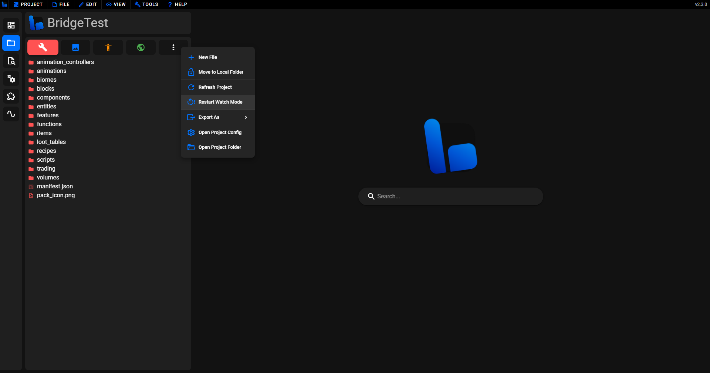

# 🔁 com.mojang Syncing

bridge. can seamlessly sync your projects to your `com.mojang`'s "development_behavior_packs" and "development_resource_packs" folders.
In this article you will find out:

:ballot_box_with_check: How to setup com.mojang syncing. 
:ballot_box_with_check: How to compile files changed outside of bridge. 
:ballot_box_with_check: What to do when Dash's watch mode produced an unexpected compilation output. 

## Basics

By default, bridge. stores your projects outside of the `com.mojang` folder which means they won't show up in Minecraft. However, bridge. can compile your packs to the `com.mojang` folder, providing you have linked it to bridge.

:::warning
Before you proceed, ensure you own and have installed Minecraft Bedrock on your Windows device.
:::

## Setup

The `com.mojang` folder, on windows, desktop (currently only platform that supports this feature) is located at `C:\Users\<USER>\AppData\Local\Packages\Microsoft.MinecraftUWP_8wekyb3d8bbwe\LocalState\games\com.mojang`. 

:::tip
You can quickly access this by pressing `Windows Key + R` and pasting the following `%localappdata%\Packages\Microsoft.MinecraftUWP_8wekyb3d8bbwe\LocalState\games\com.mojang`
:::

Once you have located this folder, all you need to do is drag it from the file explorer onto bridge. at any time. Then you should see the following choice prompt:

Simply press the "Output Folder" option to set this as Dash's compilation output directory. You packs will now automatically update in Minecraft's development folders when you make a change in bridge.

## Fetch for Changes

Sometimes you will need to edit files in your project from outside of bridge. In order for these external changes to be picked up by bridge. and compiled to your `com.mojang` folder, you will need to refresh the project to fetch the changes. The option to do this is found in the pacik explorer context menu, as shown below.

## Restart Watch Mode

If for any reason bridge. hasn't compiled your entire pack correctly and your changes aren't showing up correctly in game, there's an option to force a full dev mode compilation called "Restart Watch Mode".

This can be found in the compiler window or quickly in the pack explorer context menu, as shown in the screenshot below.

