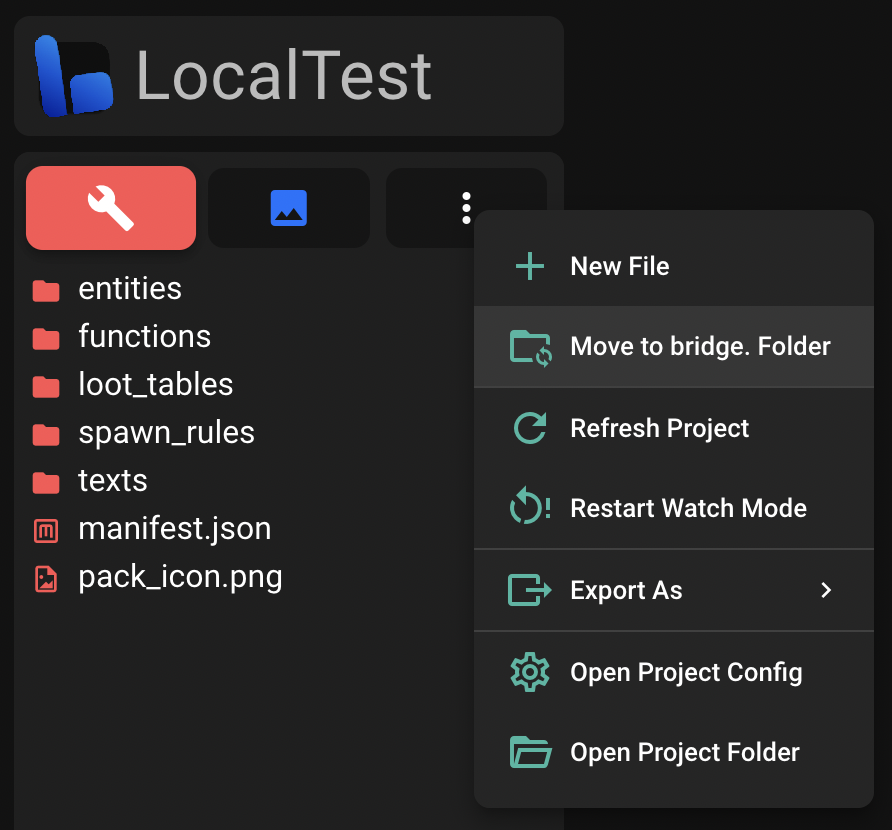

# 🗂 Project Types

While using bridge. v2, you may encounter multiple different project types. The following article acts as an introduction to them so you can learn...

:ballot_box_with_check: How you can work on an Add-On project. 
:ballot_box_with_check: Which project type fits your style of working best. 

:::warning
If you are using bridge. v2 on a mobile device or unsupported browser, you cannot make use of the different project types outlined below.
:::

## bridge. Folder

This is the recommended way to work on an Add-On project. bridge. will place the project within your bridge. folder and [sync your packs](/guide/misc/com-mojang-syncing/) to your `com.mojang`'s "development_behavior_packs" and "development_resource_packs" folders whenever you make changes.

## Local Project

Local projects behave similarly to bridge. projects, the only difference being that you cannot access them outside of bridge. v2. In return, you can open them without a permission prompt.

Local projects show a special badge within the project chooser so you can easily distinguish them from normal projects.

You can convert a local project to a normal project over the "More" menu within the pack explorer.

:::danger
You cannot use git or other version control systems on a local project.
:::

## `com.mojang` Project

bridge. v2 additionally loads all behavior packs (and connected resource packs) from the `com.mojang`'s "development_behavior_packs" and "development_resource_packs" folders. In order for this to work, you must set the [`com.mojang` folder as an output folder](/guide/misc/com-mojang-syncing/#setup).

:::warning
`com.mojang` projects cannot make use of [advanced file creation](/guide/features/#advanced-file-creation) yet.
:::

`com.mojang` Projects show a special badge within the project chooser so you can easily distinguish them from normal projects.

:::tip
There is a setting to enable/disable automatic loading of projects from your `com.mojang` folder. Make sure that you have enabled this setting in order for your `com.mojang` projects to appear within the project chooser.
:::

## Open Folder or File

You can also drag any file or folder onto bridge. to start editing it. This is ideal for making quick edits to a project without having to manually import it. Thanks to bridge.'s excellent file type guessing, you will get the full auto-completion, syntax highlighting, and file validation experience you come to expect from regular bridge. projects.
